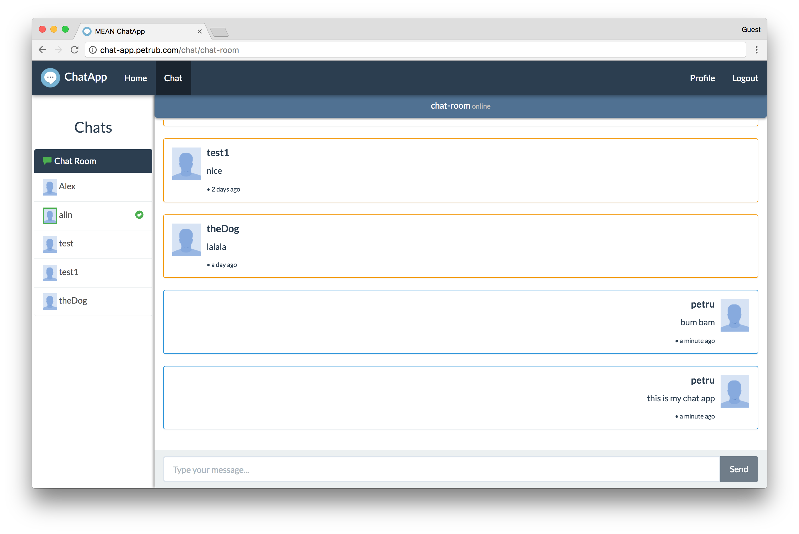
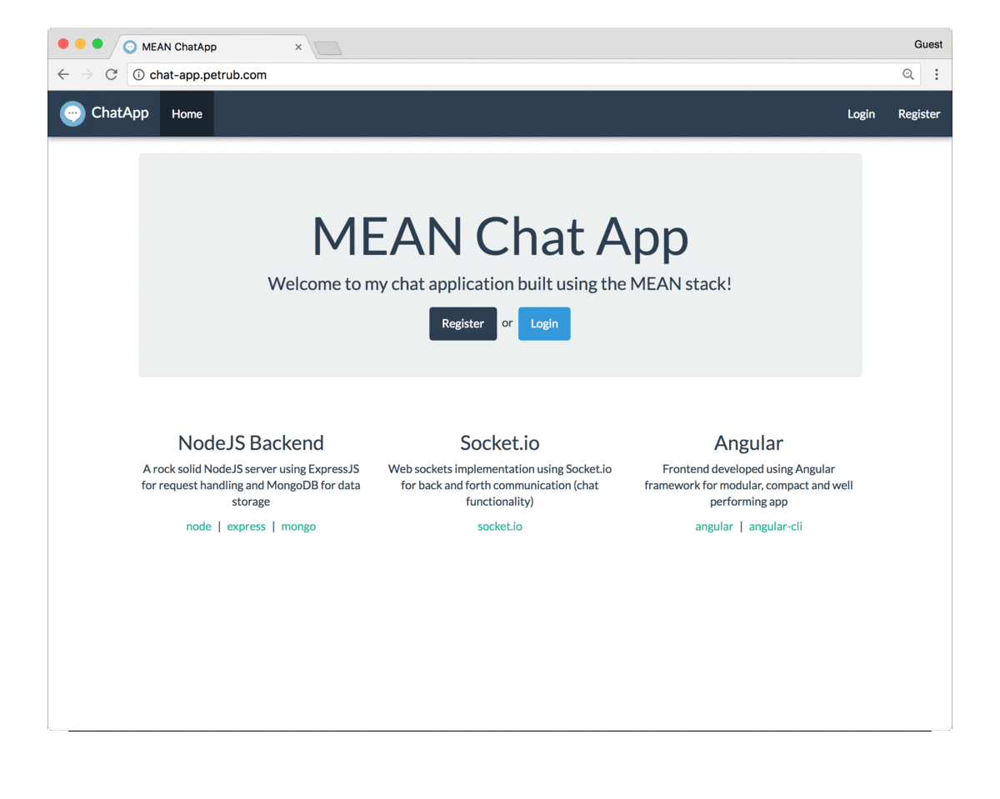

# MEAN Chat App

>Una pequeña aplicación de chat creada con el stack MEAN  


# Features

Registrar y autenticar usuarios usando tokens web JSON

- Únase a una sala común donde puede chatear con todos los usuarios registrados

- Abra conversaciones privadas 1 a 1 con un usuario de su elección

- Notificaciones de mensajes sobre conversaciones en segundo plano.

- Tenga una UI/UX agradable creada para verse increíble desde el móvil al escritorio
<p align="center">
  
</p>

# Empezando

### Requisitos

- [NodeJS](https://nodejs.org)
- [MongoDB](https://www.mongodb.com/)
- [Angular-CLI](https://cli.angular.io/)

```bash
# clone the repo
git clone https://github.com/petr166/mean-chat-app.git

# [backend api]
# cambiar al directorio repo
cd mean-chat-app

# instalar dependencias del servidor
npm install

# !¡cree un archivo .env con el modelo de .env.example!
cp .env.example .env

# iniciar el servidor de desarrollo
npm run dev


# ahora abre otra ventana de terminal
# [aplicación angular de]
# cambiar al directorio angular src
cd angular-src

# instalar dependencias frontend
npm install

# iniciar el servidor de desarrollo angular
npm start
```

Then visit http://localhost:4200 in your browser.

# Technologies

- [NodeJS](https://nodejs.org/) - Solución de elección del lado del servidor/backend de JavaScript

- [Express](https://expressjs.com/) - Marco de node que facilita el manejo de solicitudes http

  - [JsonWebToken](https://www.npmjs.com/package/jsonwebtoken) - paquete que ayuda a generar JWT para una autenticación segura

  - [PassportJS](http://passportjs.org/) - middleware de autenticación utilizado para proteger ciertas partes de la aplicación para solicitudes no autenticadas

- [MongoDB](https://www.mongodb.com/) - solución de almacenamiento de datos que solo habla JSON y se empareja muy bien con Node

  - [Mongoose](http://mongoosejs.com/) - paquete que ayuda con el modelado de objetos y administra la conexión entre el servidor y la base de datos

  - [Bcryptjs](https://www.npmjs.com/package/bcryptjs) - para saltear y codificar la contraseña de usuario que se almacenará en la base de datos


# Cómo funciona

En el lado del cliente, los usuarios pueden crear cuentas que se almacenarán en la base de datos. Luego, los usuarios pueden autenticarse con las credenciales dadas, si son correctas, el servidor envía un token único al cliente. El cliente lo almacena para usarlo en solicitudes de ruta de back-end restringidas.

Una vez autenticado, el servidor crea una conexión bidireccional de socket con el cliente para facilitar la funcionalidad de chat.

Cada vez que un usuario envía un mensaje, este va al servidor que lo redirige al encuestado deseado. Además cada vez que un usuario entra o sale del chat, el servidor anuncia todos los clientes conectados.
